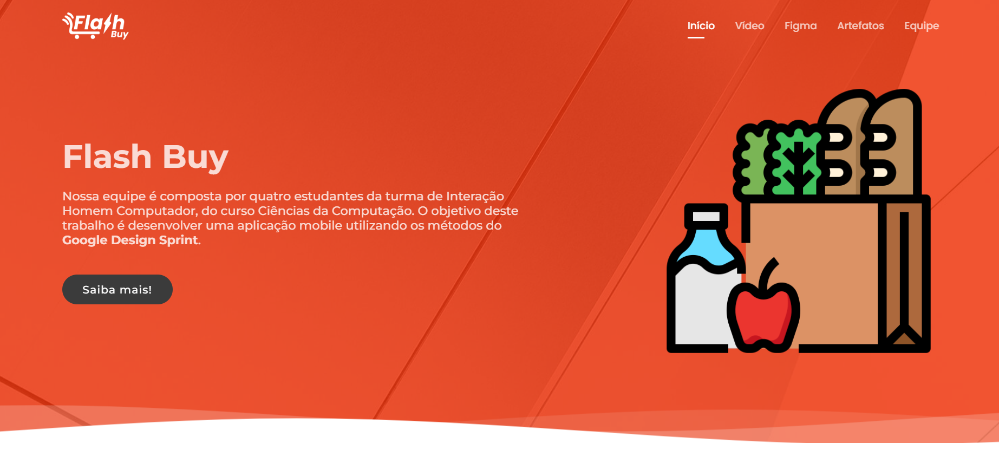
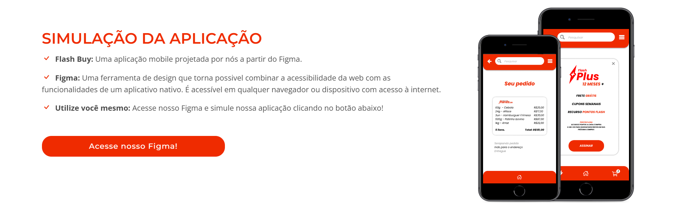

<!-- PROJETO -->

<h1 align="center"><strong>Flash Buy ⚡️</strong></h1>

<h3 align="center">Projeto desenvolvido para a matéria de Interação Homem Computador</h3>

  <a href="#sobre">Sobre o projeto</a>&nbsp;&nbsp;&nbsp;|&nbsp;&nbsp;&nbsp;
  <a href="#tecnologias">Tecnologias utilizadas</a>&nbsp;&nbsp;&nbsp;|&nbsp;&nbsp;&nbsp;
  <a href="#planejamento">Planejamento</a>&nbsp;&nbsp;&nbsp;|&nbsp;&nbsp;&nbsp;

[ <a href="https://duumauzin.github.io">Acesse o site aqui </a> ]

---

---

<!-- SOBRE O PROJETO -->

<h2 align="center"> <strong> Sobre o projeto </strong> </h2>

 

&nbsp;&nbsp;&nbsp;&nbsp;Este é um projeto de código aberto com o intuito de apresentar a prototipagem de uma aplicação mobile, denominada Flash Buy, para a matéria de Interação Homem Computador.

[ `Website estático` ]

[ `Landing Page` ]

[ `Responsivo` ]

 

---

<!-- TECNOLOGIAS UTILIZADAS -->

<h2 align="center"> <strong> Tecnologias utilizadas </strong> </h2>

 

- HTML
- CSS
- JavaScipt

 

---

<!-- USAGE EXAMPLES -->

<h2 align="center"> <strong> Planejamento do projeto </strong> </h2>

 

- Prototipagem do website: `PowerPoint`
- Prototipagem da aplicação mobile: <a href="https://www.figma.com/proto/pcA9eF1ckzWF29uI60YTVR/Untitled?node-id=1%3A8&scaling=scale-down&page-id=0%3A1&starting-point-node-id=1%3A4&show-proto-sidebar=1">`Figma`</a>

 

---

[ <a href="#topo">Voltar para o topo</a> ]
